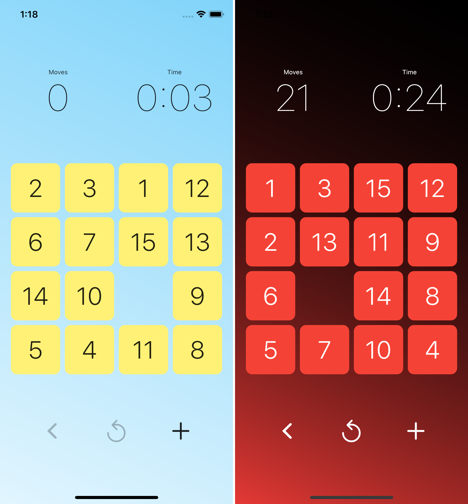

# Fifteen Puzzle

<!--  -->

A classic puzzle game _Fifteen Puzzle_ with minimalistic design, implemented in Flutter and available on Apple App Store and Google Play.

## Rules

The rules are very simple. In a 4-by-4 grid, you need to arrange tiles in order, from 1 to 15 (in first row there must be tiles 1 to 4, in second 5 to 8, in third 9 to 12, and in last 13 to 15), with the bottom right corner being empty.

## Puzzle generation

Not every starting composition is solvable, therefore a generating algorithm has to be introduced.

For the starting composition to be solvable, the following must be true.

- If empty square is on even row from top to bottom, counting from 1 to 4, then the number of _inversions_ must also be even.
- If empty square is on odd row from top to bottom, then the number of _inversions_ must also be odd.

Here, a pair `(a,b)` forms anx _inversion_, if `a > b` and `a` comes first in the sequence of numbers, if one is to lay them in a vector instead of 4-by-4 grid. For example, in `1,2,3,6,4,5,7,8,9,10,11,12,13,14,15` we have 2 inversions, since `6` comes before `4` and `5`.

### Actual algorithm

However, we are not using the points above for generation, because it would easily get complicated and potentially
time consuming to generate permutations, count inversions, etc. The simpler and to human more intuitive approach is to
take the solved puzzle and scramble it. So, we take a solved 4-by-4 matrix and perform a random walk of 1000 iterations with empty square. The result is the puzzle the player gets to solve. Simple, but clever, ha 😜?

## Application

### iOS

### Android

## Privacy Policy

Privacy policy is available [here](PRIVACY_POLICY.md).

## Contributing and error reporting

If you find an issue in game or have a good idea for a new feature, please file an issue in the issues tab or submit a pull request directly. Just keep in mind, this is a Flutter project, not native mobile development 😉.
