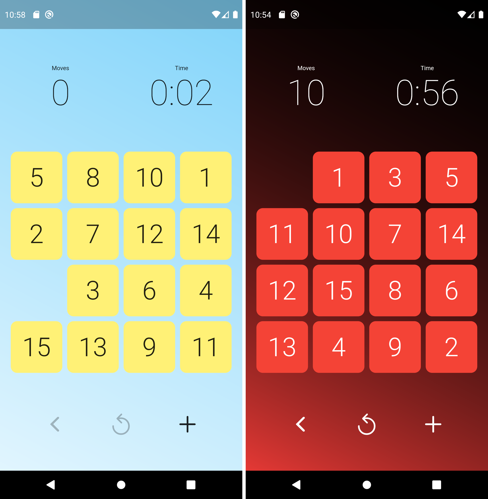

# Fifteen Puzzle

<!--  -->

A classic puzzle game _Fifteen Puzzle_ with minimalistic design, implemented in Flutter and available on Apple App Store and Google Play.

## Rules

The rules are very simple. In a 4-by-4 grid, you need to arrange tiles in order, from 1 to 15 (in first row there must be tiles 1 to 4, in second 5 to 8, in third 9 to 12, and in last 13 to 15), with the bottom right corner being empty.

## Application

### iOS

### Android

## Privacy Policy

Privacy policy is available [here](PRIVACY_POLICY.md).

## Contributing and error reporting

If you find an issue in game or have a good idea for a new feature, please file an issue in the issues tab or submit a pull request directly. Just keep in mind, this is a Flutter project, not native mobile development 😉.
